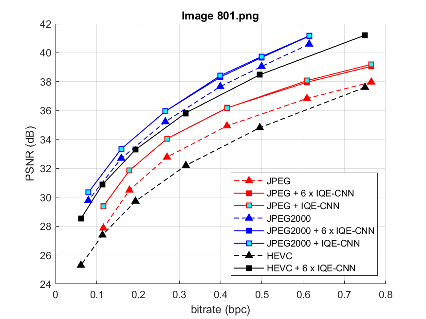
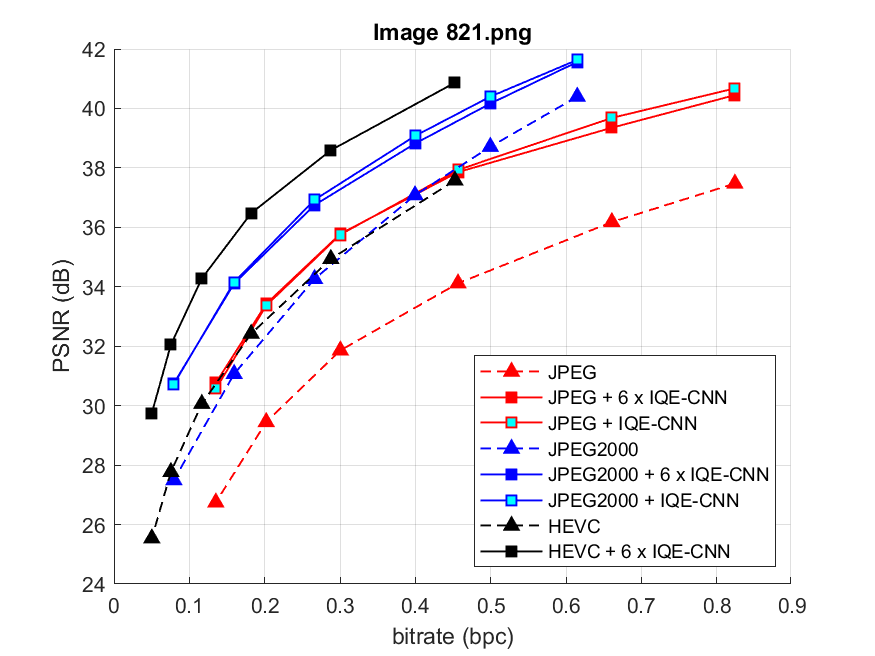
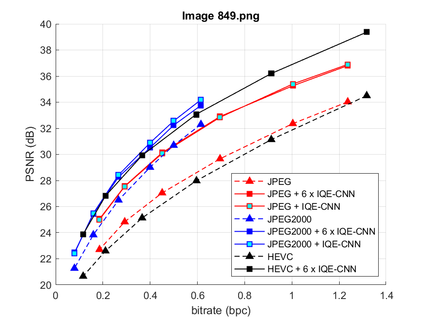
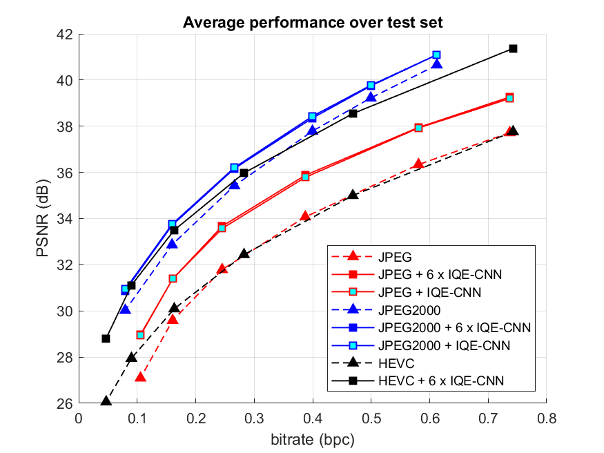
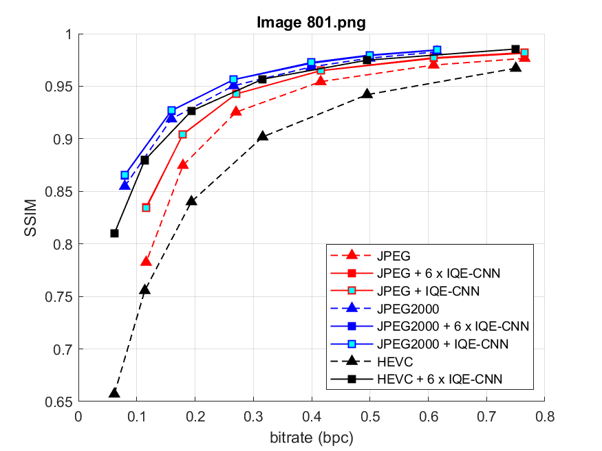
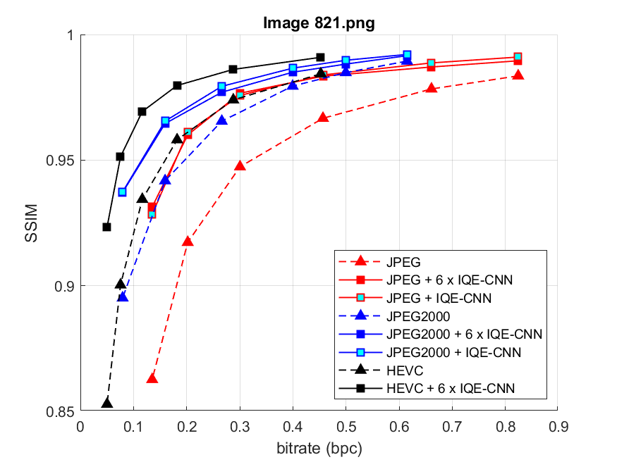
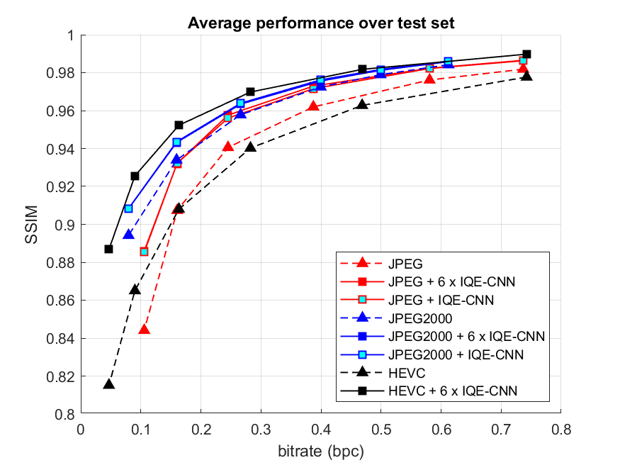
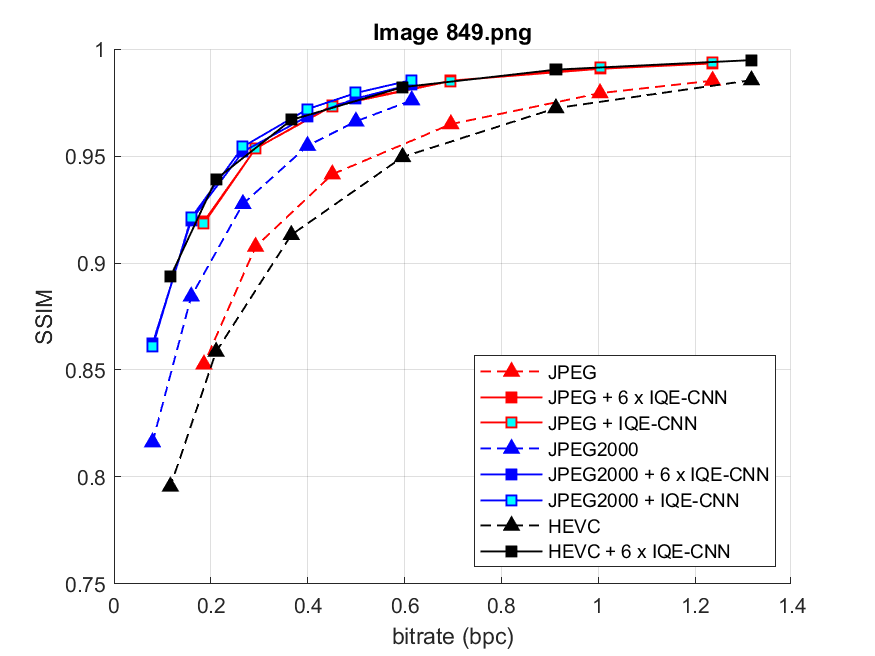
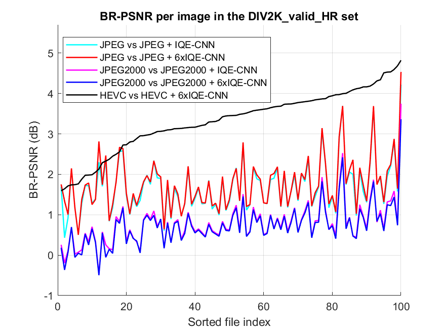
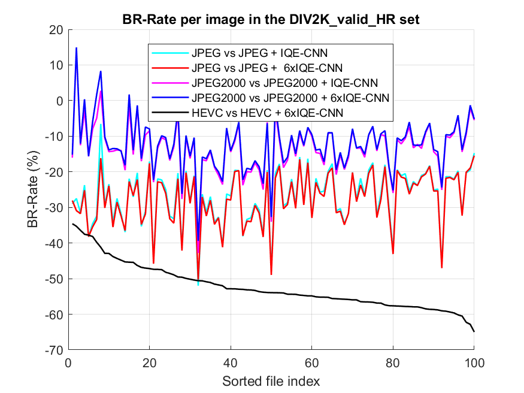

Revision of the manuscript entitled “CNN-based Post-filtering for Image Quality Enhancement" submitted for publication to IEEE International Conference on Image Processing (IEEE ICIP) 2021.

Following the reviewers request, a comparison with HEVC will be added in the manuscript.\
IQE-CNN provides BD-Rate grains of around 52.33% and average BD-PSNR improvement of 3.3246 dB over HEVC.

Figures 3 and 4 in the manuscript will be updated as shown below.

<table>
  <tr>
    <td> </td>
    <td> </td>
    <td> </td>
    <td> </td>
   </tr> 
   <tr>
      <td> </td>
      <td> </td>
      <td> </td>
      <td> </td>
  </tr>
</table>

Fig. 3. Rate-distortion results for three images, <b>(1st column)</b> <i>Image801.png</i>, <b>(2nd column)</b> <i>Image821.png</i>, <b>(3rd column)</b> <i>Image849.png</i>, and <b>(4th column)</b> over the entire test set, DIV2KvalidHR dataset [24]. <b>(Top)</b> bpc-vs-PSNR results. <b>(Bottom)</b> bpc-vs-SSIM results.

<table>
  <tr> 
    <td> </td>
    <td> </td>
 </tr>
</table> 
Fig. 4. Bjontegaard metrics for every image in the DIV2KvalidHR dataset [24]: <b>(left) </b> BR-PSNR (dB), <b>(right)</b> BR-Rate (%).

